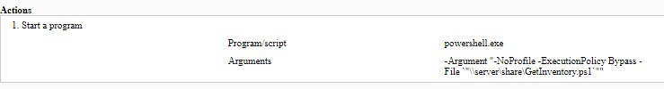

# Computer Inventory PowerShell Script

This PowerShell script is crafted to remotely collect a wide array of system and software-related information from one or multiple computers. It compiles this data into an inventory report in JSON format and facilitates its transfer to a centralized fileshare location for thorough analysis.

## Features

- Collects a variety of metrics:
  - Group memberships of specified groups.
  - Basic system information including OS version, CPU, RAM, etc.
  - Disk space details for each drive.
  - List of installed software.
  - Details about personal certificates in the LocalMachine\My certificate store.
  - AutoRun application information.
  - Share access details on the target computer.

- Capable of simultaneous execution on multiple remote computers.

- Allows customization of the metrics to be queried and the target computer name.

- Includes error and information logging for troubleshooting purposes.

## Usage

1. **Script Execution**:
   Run the script using your preferred [deployment method](#deployment-methods). The script will gather the specified metrics and save them in JSON format in separate folders.

2. **Data Management**:
   The gathered data is then compressed, and the resulting zip file is moved to a central fileshare location. See [Setup Central Fileshare](#setup-central-fileshare) for more details.

3. **Data Parsing**:
   Upon completion of data collection, process the data using [Parse Computer Inventory PowerShell Script Collected Data](#parse-computer-inventory-powershell-script-collected-data).

## Setup Central Fileshare

### Folder and File Share Setup Script

Use the "NewCentralFileShare.ps1" script to create a fileshare on a fileserver accessible by the computers intended to run this script.

#### Overview

This script sets up a folder structure and configures sharing and NTFS permissions for efficient inventory data management. It automates the creation of a main folder and a subfolder, shares the main folder with specific access rights, and sets NTFS permissions for domain computers and administrators.

#### Features

- **Folder Creation**: Automatically creates a main folder and a subfolder if not already present.
- **SMB Sharing**: Shares the main folder on the network with 'Change' permissions for specified user groups.
- **NTFS Permissions**: Configures specific NTFS permissions for both the main and subfolder for various user groups.

#### Script Details

1. **Folder Paths**:
   - `$FolderPath`: Path for the main folder.
   - `$SubFolderPath`: Path for the subfolder within the main folder.
2. **Share Setup**:
   - `$ShareName`: Name for the network share of the folder.
   - Shares the main folder with 'Change' permission for 'Everyone'.
3. **NTFS Permissions**:
   - Sets specific permissions for 'Domain Computers' and 'Everyone'.
   - Grants 'Administrators' and 'SYSTEM' full control over both folders.
   - Allows customization of inheritance and rights through the `Set-NTFSPermissions` function.

#### Example Usage

1. Define `$FolderPath`, `$SubFolderPath`, and `$ShareName` as required.
2. Run the script to create the folders, share the main folder, and set NTFS permissions.

## Deployment Methods

### 1. Group Policy with Scheduled Task

Import the sample GPO provided in this repository, "Device - Deploy Inventory Collector". Remember to update the script path.

### 2. Defender For Endpoint Live Response Integration

The script is compatible with Defender For Endpoint Live Response. Ensure Live Response is set up (See Documentation). 

Refer to the blog article for more on using Custom Script in Live Response: [Incident Response Part 3: Leveraging Live Response](https://kqlquery.com/posts/leveraging-live-response/).

To run unsigned scripts in Live Response:

- Navigate to security.microsoft.com
- Go to Settings > Endpoints > Advanced Features
- Enable Live Response and unsigned script execution

Execute the script:

- Visit the device page and initiate a Live Response session
- Upload the script to the library
- Use the ***run*** command to execute the script

### 3. Other Methods

Deploy using software like ConfigMGR or other deployment tools.

## Parse Computer Inventory PowerShell Script Collected Data

### Description

`ParseInventory.ps1` processes and aggregates inventory data from multiple servers. It handles zipped files containing JSON files of various system metrics, compiling the data into separate JSON files for each metric type.

### Functionality

- **Dynamic Parsing**: Handles JSON files in zip archives, eliminating the need for predefined metrics.
- **Flexible Aggregation**: Aggregates data based on dynamically determined metric names from folder names.
- **Error Handling**: Includes robust error handling mechanisms.

### Execution Instructions

1. **Set Parameters**:
    - `$fileSharePath`: Path to the fileshare with zip files.
    - `$extractPath`: Temporary path for extracting zip contents.
    - `$aggregateOutputPath`: Path for saving aggregated JSON files.

2. **Run the Script**:
   Execute in PowerShell. It processes each zip file, extracting contents and aggregating data into separate JSON files.

3. **Check Results**:
   Inspect the `$aggregateOutputPath` for aggregated JSON files.

### Output

Outputs aggregated JSON files named after each metric (e.g., `SystemInfo.json`), containing combined data from all processed servers for that metric.
