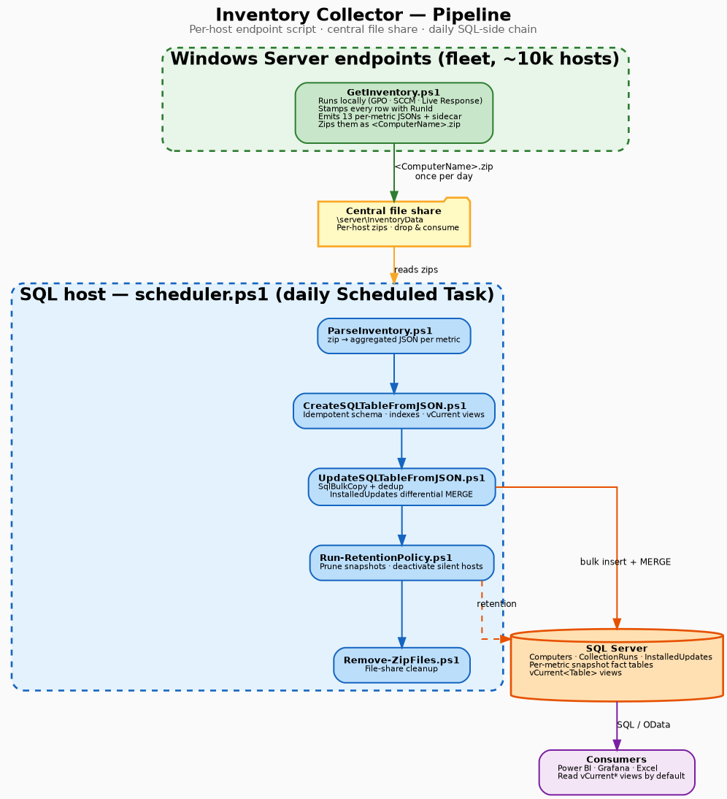
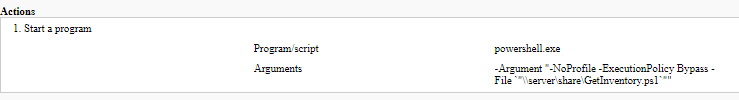

# Inventory Collector

A PowerShell pipeline that collects Windows Server inventory data from every
host in a fleet, aggregates it on a central file share, and loads it into a
SQL Server database with daily history and a retention policy. Designed to
run unattended on a daily schedule. Tested at 10,000-server scale.


**[Architecture](#architecture)** · **[Metrics](#metrics)** ·
**[Endpoint deploy](#endpoint-deployment)** ·
**[SQL host setup](#sql-host-setup)** · **[Testing](#testing)** ·
**[brief.md](brief.md)** (deep design notes)

---

## Architecture



Each collection gets a `RunId` (GUID) that's stamped on every row, so daily
history is preserved and `vCurrent<TableName>` views always return the
latest snapshot per host. See [brief.md](brief.md) for the full schema and
the design rationale. Diagram source: [`docs/diagrams/architecture.dot`](docs/diagrams/architecture.dot) (Graphviz).

---

## Metrics

`GetInventory.ps1` runs locally on each Windows Server and emits one JSON
per metric, plus a `_collection-meta.json` sidecar:

| Metric | What it captures |
|---|---|
| `SystemInfo` | OS version, CPU, RAM, GPRESULT lastApplied, etc. |
| `DiskSpace` | Per-drive size and free space |
| `InstalledSoftware` | Registry-enumerated installed software |
| `InstalledUpdates` | Installed KBs — **differential** model with `FirstSeenAt` / `LastSeenAt` / `UninstalledAt` |
| `Services` | All services + state + start type |
| `ScheduledTasks` | All scheduled tasks + author + state |
| `AutoRunInfo` | Registry / startup-folder autoruns |
| `PersonalCertificates` | `LocalMachine\My` certificate metadata |
| `LocalUsers` | Local user accounts |
| `GroupMembers` | Administrators + Remote Desktop Users membership |
| `ShareAccessInfo` | SMB share access entries |
| `UserProfileList` | Local user profile folders |
| `MPComputerStatus` | Defender / MpComputerStatus snapshot |

All metrics other than `InstalledUpdates` use a **snapshot model**: every
collection inserts a fresh set of rows tagged with the `RunId`.
`InstalledUpdates` uses a differential model — one row per
`(Computer, Title)` for the lifetime of that install, with `UninstalledAt`
set when a KB stops being reported. This collapses ~1.2 B rows (snapshot
at 10k servers × 90 days) down to ~13 M while preserving "currently
installed" semantics.

---

## Endpoint Deployment

### Group Policy with Scheduled Task

Import the sample GPO `Device - Deploy Inventory Collector` and update the
script path inside it to wherever you keep `GetInventory.ps1`.



### Defender For Endpoint Live Response

The script is compatible with Defender For Endpoint Live Response. Enable
unsigned script execution at
**security.microsoft.com → Settings → Endpoints → Advanced features**,
upload the script to the library, and run it from a device's Live Response
session. Background context: [Incident Response Part 3: Leveraging Live
Response](https://kqlquery.com/posts/leveraging-live-response/).

### SCCM / ConfigMGR / other deployment tooling

`GetInventory.ps1` is self-contained — no dependencies beyond PowerShell
5.1 and Windows Server. Any deployment mechanism that can run a single
`.ps1` is fine.

### Endpoint script parameters

```powershell
GetInventory.ps1 `
    -ComputerName          $env:computerName `        # default: local host
    -centralFilesharePath  '\\server\InventoryData'   # default in script
```

The script writes one zip named `<ComputerName>.zip` to the file share. If
the zip already exists, the script exits silently — safe to re-run on the
same day.

---

## File Share Setup

`NewCentralFileShare.ps1` creates the receiving file share on a Windows
file server:

- Creates a main folder and a subfolder if missing.
- Shares the main folder with `Change` permission for the user groups you
  specify.
- Sets NTFS permissions for `Domain Computers` (write), `Everyone`,
  `Administrators`, and `SYSTEM`.

Edit `$FolderPath`, `$SubFolderPath`, and `$ShareName` at the top of the
script, then run on the file server.

---

## SQL Host Setup

The server-side chain runs on a single Windows box that has SQL Server
access.

1. Install SQL Server (Standard / Express / LocalDB all work — LocalDB is
   for testing only).
2. Create the target database. The chain creates all tables, indexes, and
   views on first run — no manual schema.
3. Copy the script chain to a folder on the SQL host.
4. Edit `config.xml`: set paths, `SqlServer`, and `Database` for each step.
5. Register `scheduler.ps1` as a daily Scheduled Task.

### What the chain does

| Step | Script | Notes |
|---|---|---|
| 1 | `ParseInventory.ps1` | Walks the file share, expands outer + inner zips, aggregates rows from every host into one JSON per metric in `$aggregateOutputPath`. Per-step try/catch with `$script:hasErrors` — the chain exits non-zero on real failures rather than silently continuing. |
| 2 | `CreateSQLTableFromJSON.ps1` | Idempotent. Creates `Computers`, `CollectionRuns`, `InstalledUpdates` infrastructure tables, then one snapshot fact table per JSON file with auto-discovered columns, FK constraints, `UX_<Table>_Natural` UNIQUE index, and a `vCurrent<TableName>` view. Adds columns via `ALTER TABLE` if later JSONs introduce new properties. |
| 3 | `UpdateSQLTableFromJSON.ps1` | Bulk-loads each fact table via `SqlBulkCopy` into a `#temp` staging table, deduplicates with `ROW_NUMBER()`, then `INSERT ... WHERE NOT EXISTS` into the target. `InstalledUpdates` uses a single set-based `MERGE`. |
| 4 | `Run-RetentionPolicy.ps1` | Three idempotent actions: drop `CollectionRuns` older than the most recent N per Computer (FK cascade prunes facts), drop `InstalledUpdates` whose `UninstalledAt` is older than M days, set `Computers.IsActive = 0` for hosts that haven't reported in K days. |
| 5 | `Remove-ZipFiles.ps1` | Deletes processed zips from the file share. |

### Consumer query patterns

Power BI / Grafana / Excel / anything that speaks SQL — start with the
views, not the raw fact tables:

| View | Returns |
|---|---|
| `vCurrent<TableName>` | Latest-RunId snapshot per Computer (one per snapshot fact table). |
| `vCurrentInstalledUpdates` | `InstalledUpdates WHERE UninstalledAt IS NULL`. |
| `vStaleComputers` | Active Computers whose `LastSeenAt` is older than 25 hours. |

Trend visuals read the raw fact tables and filter by `RunId` or join on
`CollectionRuns`. The fact tables keep daily history until the retention
policy drops them.

### Security

All SQL operations use parameterised `SqlCommand.Parameters` via the
shared `SqlHelpers.ps1` module — values are never string-concatenated
into SQL text. Table and column names go through `Test-SqlIdentifier`,
which rejects anything outside `[A-Za-z0-9_ ]`. SQL-injection payloads
are covered by the integration test suite.

The Azure SQL variants `*_azure.ps1` still use the legacy
string-concatenated pattern and the old per-row INSERT path. They're
slated for a full rewrite under Managed Identity auth — see [TODO.md](TODO.md).

---

## Scale and Performance

Measured end-to-end on LocalDB, single machine, modest hardware:

| Scale | Update step | Peak RAM |
|---|---:|---:|
| 1k servers / 13k rows | 15 s | ~200 MB |
| 10k servers / 196k rows | 125 s | ~700 MB |
| 10k servers + 5.3M `InstalledUpdates` rows | 156 s | ~700 MB |
| 10k servers / ~13M IU rows (projected, real customer density) | ~7 min | ~700 MB |

Two things keep the loader scaling linearly:

1. **`SqlBulkCopy` + staging table + set-based dedup** instead of per-row
   `INSERT` — moves the dominant cost from network round-trips to index
   maintenance, ~4-5× throughput at any scale.
2. **Streaming JSON reader for `InstalledUpdates`** — a compiled C#
   `IDataReader` over a tokeniser; the full JSON is never materialised
   in memory. Peak RAM stays flat regardless of input size.

For the schema, idempotency, retention, and storage-size projections, see
[brief.md](brief.md).

---

## Testing

The `test/` folder contains LocalDB-backed unit + integration tests plus
an anonymised customer fixture (1,059 servers, ~1.7 MB).

```powershell
# One-time setup
.\test\Download-SqlLocalDB.ps1 -Install
Expand-Archive .\test\sample-data\InventoryParsed.zip .\test\sample-data\InventoryParsed

# Run everything
.\test\Run-AllTests.ps1
```

- **`Test-Integration-LocalDB.ps1`** — 10+ end-to-end tests against a
  real LocalDB instance using the anonymised fixture. Covers schema
  creation, idempotent re-loads, schema evolution (ALTER TABLE branch),
  SQL-injection payloads, the `InstalledUpdates` differential model,
  and `vCurrent*` views.
- **`Test-SqlInjectionFix.ps1`** — 64 unit tests for `SqlHelpers.ps1`.

See [test/TESTING.md](test/TESTING.md) for the full walkthrough including
the end-to-end loop (`GetInventory` → `ParseInventory` → SQL) on a single
machine, and the fixture-refresh process (`Anonymize-InventoryData.ps1`).

---

## Status

Production-ready for on-prem SQL Server (Windows authentication).

Open items tracked in [TODO.md](TODO.md):

- Azure SQL scripts (`*_azure.ps1`) need a full rewrite — Managed Identity
  auth, parameterised queries, `SqlBulkCopy` path.

Known constraints documented in [brief.md](brief.md):

- `ServerAccess`, `ServerList`, `ServerOverview`, `ADServers` are not
  produced by `GetInventory.ps1`; a customer-specific external collector
  drops them into the share. Schema mismatch on `ComputerName` is handled
  defensively but should be fixed upstream.
- LocalDB `tempdb` pressure on 5M+ row `MERGE` ops — production SQL Server
  with appropriately sized tempdb is unaffected.
- PowerShell 5.1 is the production target; PS 7+ works but falls back to
  a slower in-PowerShell `DataTable` build for the `InstalledUpdates`
  streaming reader.
